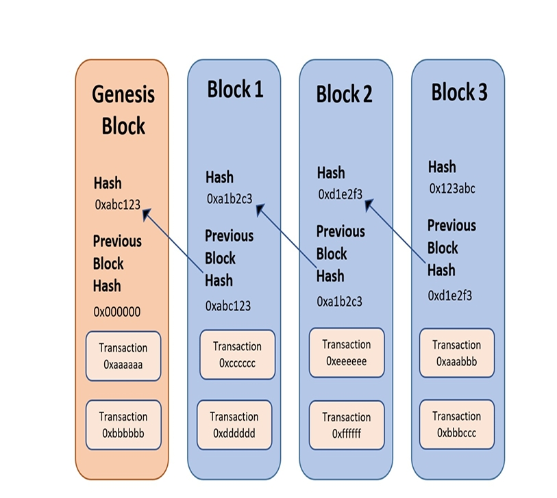

# How Are Blocks Related to Each Other?

## Parent–Child Relationship
- In **Ethereum (and blockchain in general)**, every block is linked to another block in a **parent–child relationship**.
- **One parent → one child**.  
- **One child → one parent**.  
- This structure creates a **chain of blocks** → hence the name *blockchain*.

---

## How the Relationship Works
- Each block has a **header**.  
- Inside the header, the **hash of the parent block** is stored.  
- This means:
  - Block 2 contains the hash of Block 1.  
  - Block 3 contains the hash of Block 2.  
- By chaining hashes like this, the blockchain ensures **immutability**:
  - If someone tries to change Block 1, its hash changes.  
  - But Block 2 depends on that hash, so Block 2 becomes invalid → and so on down the chain.  

---

## Example
- **Block 1** = Parent of Block 2.  
- **Block 2** = Child of Block 1 *and* Parent of Block 3.  
- **Block 3** = Child of Block 2.  

---

## 🔑 Analogy
Think of blocks like **pages in a diary**:
- Page 2 starts with a **summary line** that says: *“This continues from Page 1.”*  
- Page 3 starts with a line: *“This continues from Page 2.”*  
- If someone rips out or edits Page 1, then Pages 2 and 3 no longer make sense.  

That’s how blockchain ensures **consistency and trust** across all pages (blocks).

---

## Diagram (Simplified)
```
Block 1  --->  Block 2  --->  Block 3
   ↑           ↑           ↑
 [Hash]     [Hash]      [Hash]
```
Each arrow means: *“I store the hash of my parent.”*



