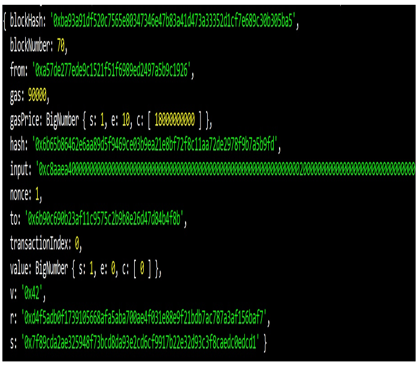

# 📄 Ethereum Transaction Object — Annotated Explanation

This note explains the important **properties of a transaction object** in Ethereum, as described in the book.  
Use this with the screenshot below to visualize each property.

---

## Key Properties of a Transaction

### `from`
- The account **originating** the transaction.  
- Can be an **externally owned account (EOA)** or a **contract account**.  
- Represents the account ready to send **gas** or **Ether**.

### `to`
- The account **receiving** Ether or interacting with the sender.  
- Can be an EOA or a contract account.  
- For contract **deployment transactions**, this field is **empty**.

### `value`
- The **amount of Ether** transferred between accounts (in **wei**).  
- If `0`, no Ether is transferred (only a contract call).

### `input`
- Contains **compiled contract bytecode** during **deployment**.  
- For contract calls, it includes:
  - The **function selector** (first 4 bytes of the hash of the function signature).  
  - The **parameters** encoded using the Ethereum ABI.  
- In the screenshot, notice the `input` field with the function call and its parameters.

### `blockHash`
- The **hash of the block** that this transaction was included in.

### `blockNumber`
- The **block number** (height) where this transaction belongs.

### `gas`
- The **gas limit** supplied by the sender.  
- Defines the maximum units of gas the sender is willing to consume.

### `gasPrice`
- The **price per unit of gas** (in wei) the sender is willing to pay.  
- **Total gas fee** = `gas × gasPrice`.

### `hash`
- The **unique hash** (identifier) of the transaction.

### `nonce`
- The number of **transactions previously sent** from the `from` account.  
- Ensures ordering and prevents replay.

### `transactionIndex`
- The **serial number** (index) of this transaction within the block.

### `v`, `r`, and `s`
- The **digital signature fields** of the transaction.  
- They prove the transaction was signed by the sender’s private key.  
- Part of Ethereum’s **ECDSA signature scheme**.

---

## Summary
A transaction object bundles together:  
- **Who sent it (`from`)**  
- **Who received it (`to`)**  
- **How much (`value`)**  
- **What was executed (`input`)**  
- **When/where it was included (`blockHash`, `blockNumber`, `transactionIndex`)**  
- **Resources used (`gas`, `gasPrice`)**  
- **Proof it was valid (`hash`, `v`, `r`, `s`)**

This makes Ethereum transactions both **verifiable** and **immutable** once mined.

---

## Suggested Title for Repo
**`ethereum_transaction_object.md`**
