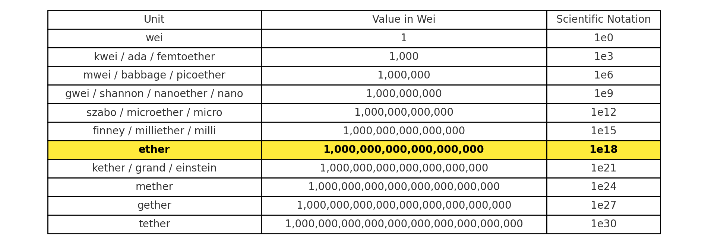

# Gas in Ethereum

## What is Gas?
- **Gas** is the *internal currency* of Ethereum.
- It measures the cost of executing operations and using resources on the Ethereum Virtual Machine (EVM).  

Think of it like the *fuel* required to run smart contracts.

---

## Gas Units (Gas Cost)
- Every operation in Ethereum (e.g., storing data, performing calculations) has a **predetermined gas cost** measured in **gas units**.  
- Example:  
  - Adding two numbers may cost `3 gas`.  
  - Writing to storage may cost `20,000 gas`.  

So, **gas cost = total units consumed by your transaction**.

---

## Gas Price
- Gas price = the amount of **Ether** you are willing to pay per unit of gas.  
- Expressed in **gwei** (1 gwei = 10⁻⁹ ETH).  

### Relationship with Ether price:
- If **Ether price goes up** → you can set a **lower gas price**.  
- If **Ether price goes down** → you might need a **higher gas price** to incentivize miners/validators.  

---

## Final Transaction Fee
The **total fee** paid for a transaction is:    

### Example:
- Gas used = `21,000` (for a simple ETH transfer).  
- Gas price = `20 gwei`.  

Fee = 21,000 × 20 gwei = 420,000 gwei = 0.00042 ETH

