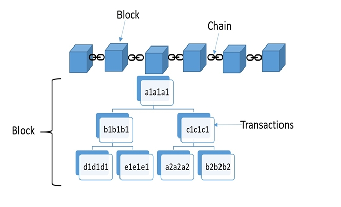

# How Are Transactions and Blocks Related to Each Other?

## Transactions Inside Blocks
- **Ethereum stores transactions inside blocks**.  
- Each block has an **upper gas limit**.  
- Every transaction consumes a certain amount of **gas**.  

### Block Gas Limit
- The **total gas** from all transactions inside a block **cannot exceed** the block’s gas limit.  
- This ensures that:
  - Not all transactions can fit in one block.  
  - Once the gas limit is reached, the block is **sealed and mined**.  
  - Remaining transactions wait for the **next block**.  

---

## Transaction Hashing
- Every transaction is **hashed**.  
- Hashes are combined pairwise to form new hashes.  
- This process repeats until a **single hash** remains:  
  - This is called the **Merkle Root**.  
  - The Merkle Root is stored in the block header.  

---

## Immutability Effect
- If **any transaction changes**:
  - Its hash changes.  
  - The Merkle Root changes.  
  - The Block Hash changes.  
  - The Child Block Hash also changes (because it stores the parent’s hash).  

This **cascading effect** ensures that transactions are **immutable**.  

---

## 🔑 Analogy
Think of it like **a folder of signed receipts**:
- Each receipt (transaction) has its own signature (hash).  
- All receipts are bundled and stamped with a **master seal** (Merkle Root).  
- If even one receipt changes, the master seal no longer matches.  

---

## Diagram (Simplified)
```
Transactions:  T1, T2, T3, T4

Hash(T1)   Hash(T2)   Hash(T3)   Hash(T4)
     \        /             \        /
      HashA                  HashB
            \              /
              Merkle Root (stored in block header)

Block -> contains Merkle Root -> ensures immutability

```

